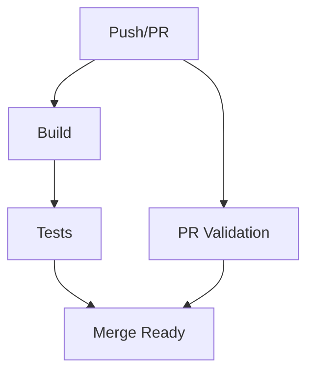

# 🔄 GitHub Actions Workflows

This repository uses automated GitHub Actions workflows to ensure code quality, security, and reliability.

## 📊 Status Badges

[](https://github.com/YOUR_USERNAME/CryptoAssistant/actions/workflows/build.yml)
[](https://github.com/YOUR_USERNAME/CryptoAssistant/actions/workflows/test.yml)
[](https://github.com/YOUR_USERNAME/CryptoAssistant/actions/workflows/pr-validation.yml)

## 🚀 Workflows Overview

### 1. **Build** ([`build.yml`](./build.yml))
- **Triggers:** Push to `main`/`develop`, PRs to `main`
- **Purpose:** Compile and build both .NET backend and React frontend
- **Artifacts:** Build outputs cached for testing
- **Dependencies:** None (entry point)

### 2. **Tests** ([`test.yml`](./test.yml)) 
- **Triggers:** After successful build, PRs to `main`
- **Purpose:** Run comprehensive test suites
- **Features:**
  - Backend: Unit tests, integration tests, code coverage
  - Frontend: Component tests, E2E tests, coverage reports
  - Codecov integration for coverage tracking
- **Dependencies:** Requires `Build` workflow success

### 3. **PR Validation** ([`pr-validation.yml`](./pr-validation.yml))
- **Triggers:** Pull requests to `main`
- **Purpose:** Comprehensive PR quality and security checks
- **Includes:**
  - 📝 PR title format validation (Conventional Commits)
  - 🔒 Sensitive file detection
  - 🎨 Code formatting and linting
  - 🛡️ Security vulnerability scanning
  - 🧪 Build and test validation
  - 💬 Automated PR status comments

## 🔧 Workflow Dependencies



## 📋 Merge Requirements

For a PR to be merged to `main`, it must pass:

- ✅ **Build Status** - Both backend and frontend build successfully
- ✅ **Test Status** - All tests pass with adequate coverage
- ✅ **PR Validation** - Quality, security, and format checks pass
- ✅ **Manual Review** - At least 1 approving review required

## 🛠️ Local Development

To run the same checks locally before pushing:

### Backend (.NET)
```bash
# Restore dependencies
dotnet restore

# Build
dotnet build --configuration Release

# Run tests
dotnet test --configuration Release

# Format code
dotnet format
```

### Frontend (React)
```bash
cd client

# Install dependencies
npm ci

# Build
npm run build

# Run tests
npm test

# Lint code
npm run lint
```

## 🔐 Security Features

- **Dependency Scanning:** Automated vulnerability detection
- **Sensitive File Detection:** Prevents credential commits
- **Code Analysis:** Static security analysis
- **Branch Protection:** Enforced via required status checks

## 📊 Coverage Reports

Test coverage is automatically:
- 📈 **Tracked** via Codecov integration
- 📋 **Reported** in PR comments  
- 🎯 **Monitored** for regression prevention

## 🚨 Troubleshooting

### Build Failures
- Check .NET version compatibility (9.0.x required)
- Verify Node.js version (20.x required) 
- Ensure all dependencies are restored

### Test Failures  
- Review test output in Actions logs
- Run tests locally to reproduce
- Check for environment-specific issues

### Security Scan Issues
- Review vulnerability reports
- Update vulnerable dependencies
- Use `npm audit fix` or `dotnet update` as appropriate

## 🔧 Customization

To modify workflows:
1. Edit the `.yml` files in this directory
2. Test changes in feature branches
3. Ensure status checks are updated in branch protection rules

---

*Generated automatically by CryptoAssistant CI/CD setup* 🤖